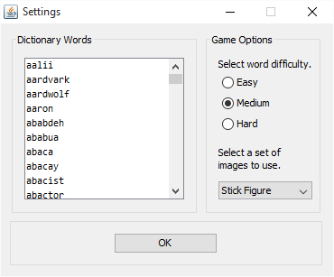
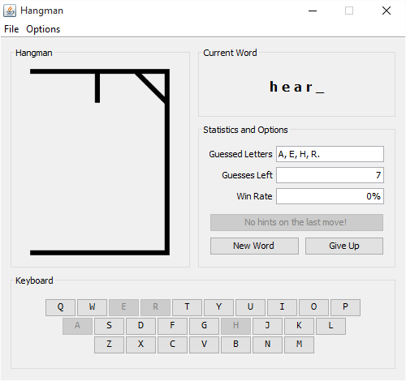
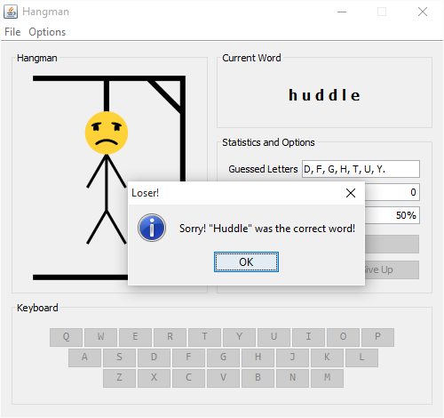

# Hangman [](https://travis-ci.org/OliverAbdulrahim/Hangman)
A playable version of the game "hangman" with a fully-functional user interface.

### How to Run
Download the latest release from [here](https://github.com/OliverAbdulrahim/Hangman/releases/download/1.0.0/Hangman-1.0.0.jar) and run the file (you'll need Java 8 or later for it to work). Or, if you prefer to run from the console, type:
```
java -jar "<location of Hangman.jar>"
```

# About
I initially made this as a console-based game in early 2015 for AP Computer Science class and later added a user interface using the NetBeans GUI builder. In September 2015, I looked back at the program and winced at some of the bad code, so I rewrote almost the entire thing, adding and removing some features along the way.

### Features
  - Input: 
    - Type the letter you want to guess or click the letter on the soft keyboard.
  - "Actor" Image Sets:
    - Images show current state of the game.
  - Game Statistics:
    - Previously guessed letters guesses left, and win rate (with tooltip text).
  - Hints:
    - Click to get a hint, if one is available.
      - This depends on the length of the current word.
  - Difficulty Selection:
    - Select from easy, medium, or hard words.
  - A secret way to cheat!
    - If you look at the source code to find what this is you'll make me sad. 

### Preview
Here are some images of gameplay!  


The settings and new game menu.  



Gameplay  



Gameplay - Won the game!  


Gameplay - Lost the game!  
